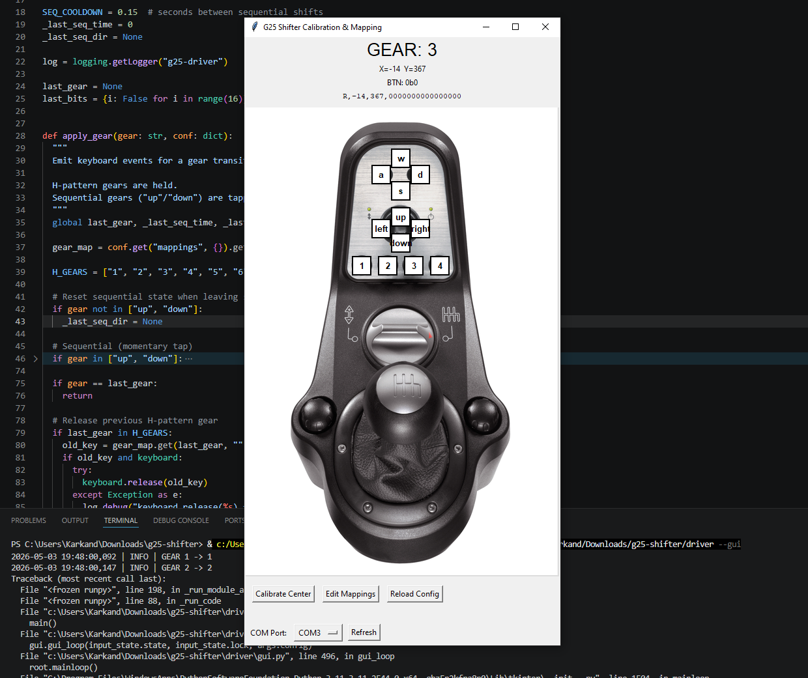

# G25 Shifter Arduino Support

Standalone, configurable support for the Logitech G25 shifter using an Arduino.

This project includes:

- An Arduino sketch (`g25-shifter.ino`) that reads the Logitech G25 shifter (DB9 connector) and streams raw X/Y axis data along with a 16-bit button state over serial.
- A Python driver in `driver/` that:
  - Reads the serial data stream
  - Maps gear positions and buttons to keyboard inputs
  - Provides a simple GUI for calibration and input mapping



## Quick Overview

- **Hardware:** Logitech G25 shifter connected to an Arduino (tested with Arduino Mega)
- **Firmware:** Upload `g25-shifter.ino` to the Arduino
- **Software:** Run the Python driver from the `driver/` directory

# Hardware Setup (Arduino)

### Recommended Board

- Arduino Mega 2560 (tested and recommended)

### Uploading the Firmware

1. Open `g25-shifter.ino` in the Arduino IDE
2. Select:
   - **Board:** Arduino Mega 2560
   - **Port:** Your Arduino COM port

3. Upload the sketch
4. Close the Arduino Serial Monitor before starting the Python driver

### Serial Configuration

The firmware uses a baud rate of `250000`.

Make sure the following value in `driver/config.json` matches:

```json
"baud": 250000
```

## Wiring (DB9 Breakout → Arduino Mega)

| DB9 Pin | Arduino Pin | Wire Color     | Function  |
| ------- | ----------- | -------------- | --------- |
| 2       | D7          | Green          | Data      |
| 3       | D5          | White          | Latch     |
| 4       | A0          | Yellow         | X Axis    |
| 5       | D4          | Orange         | Power LED |
| 6       | GND         | Black          | Ground    |
| 7       | D6          | Blue           | Clock     |
| 8       | A2          | Yellow Striped | Y Axis    |
| 9       | 5V          | Red            | Power     |

# Python Driver Setup

### Requirements

- Python 3.8 or newer

Install dependencies:

```powershell
pip install -r driver/requirements.txt
```

### Configure the Serial Port

Edit `driver/config.json` and set:

- `serial.port` to your Arduino COM port (`COM3`, `/dev/ttyUSB0`, etc.)
- `serial.baud` to `250000`

# Running the Driver

### Launch the GUI

```powershell
python driver --gui
```

### Run Headless

```powershell
python driver
```

### View CLI Help

```powershell
python driver --help
```

# Configuration & Calibration

The GUI allows you to:

- Map buttons to keyboard inputs
- Configure gear mappings
- Calibrate the shifter center position

Start the GUI with:

```powershell
python driver --gui
```

Configuration changes are automatically saved to:

```text
driver/config.json
```

# Troubleshooting

- The Python `keyboard` library may require Administrator privileges on Windows. If keyboard input is not working, run the terminal as Administrator.
- Verify that:
  - `g25-shifter.ino` is uploaded and running
  - The COM port is correct
  - The baud rate matches `driver/config.json`

- Make sure the Arduino Serial Monitor is closed before starting the Python driver, since only one application can access the serial port at a time.

# License

This project is licensed under the MIT License.

See the [LICENSE](LICENSE) file for details.
